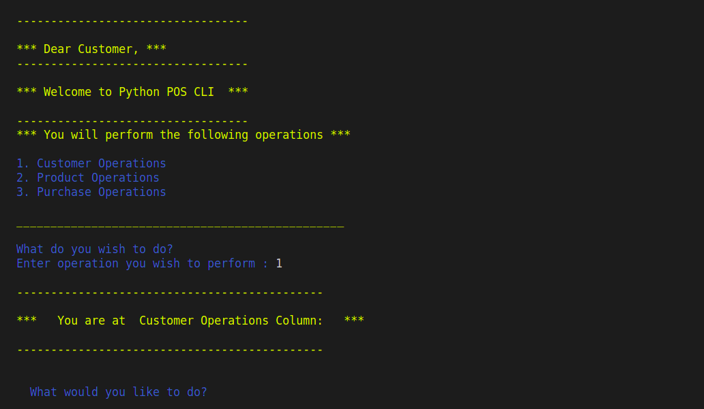

#`COMMAND-LINE POINT-OF-SALE PROGRAM IN PYTHON`
## SEPA Program Sprint one
# Sprint Deliverables
- Develop a POS system using python
- Validate input data(phone number and email)
- Print a receipt and send either via Email or SMS

## About the POS
POS Console App is a Command - Line based Point Of Sale System. 
This program is developed  using Python programming language. 
It is a single user application meant to operate in a sales store or shops. 
This system allows for CRUD operations for customers and products. When this operations are done, a customer should be able to make purchases based on the products they added to their program. This is a menu-driven program based on a user's input.
This program implemented a JSON file to store its file and SMTP for email authentication.
# POS at a glance


## Table of contents
* [About the POS](#AboutthePOS)
* [Technologies](#Technologies)
* [Features](#Features)
* [Setup](#Setup)

## Technologies
* Language: [Python 3.8](https://www.python.org/downloads/release/python-3810/)
* [JSON](https://www.json.org/json-en.html)
* [GMAIL](https://www.google.com/gmail/about/)
* IDE: [Pycharm](https://www.jetbrains.com/help/pycharm/quick-start-guide.html)

## Features
## Main Menu
A menu appears when the app is launched. It contains Customer operations, Product operations and Purchase operation.
### Customer Operations
A user is able to feed into the system customer data, view available customers, update existing customer data and delete a particular customer. All customer records can further be accessed.
A customer can be able to view available products or exit at this stage. 
The customer details are stored in customers.json

    Sample Customer details Format
    ```
        [
            {
                "name": "Vincent Kimutai",
                "age": "24",
                "email": "kimutai@gmail.com",
                "phone": "0723265092"
                  "id": "5",
            },
        ]
    ```
### Product Operations
A user can key in the product's data for inventory purposes, view the available products, update product data and delete a product. 
A customer can proceed to purchases at this point here-in or exit the program.
The products are stored at products.json file

    Sample Product details Format
    ```
        [
            {
                "name": "Dell laptop",
                "quantity": 800,
                "cost": 66_500,
                "id": 2
            },
        ]
    ```
### Purchase function
Before a customer makes any purchases, they first need to be authenticated.
When the customer is authenticated, they can then proceed to view all the available products and their quantities.
A customer can then begin to make purchases. The products they purchases are added to a cart and the totals for each product and its quantities are calculated at that point, if the customer wishes to proceed to make purchases, then their sub-totals
will be added to the previous. 
When the customer is done purchasing, a receipt is given to them which contains their name, the product they purchased, the quantities and the total cost.
The customer is further asked whether they would like to receive such a receipt via email. If the customer accepts, the receipt is send to their email and this only happens if the customer provided an existing email.
The program then terminates at this point.
Further advancement could include having a customer purchase history, checking whether a product really exists before adding it to the products json file.


## Setup
### Requirements
Python 3 is required to be installed in your system. Depending on your operating system, you can download one that is compatible from the [Official Python website](https://www.python.org/downloads/) 
### Installation
To install this application, one is required to clone this repo by running the following command on your terminal:
```bash 
git clone https://github.com/VincentLangat033/sprint-one-python-POS-CLI
```
Then enter the folder of the application by running:
```bash 
cd point-of-sale-terminal
```
Start the program by running the following command:
```bash 
python main.py
```
